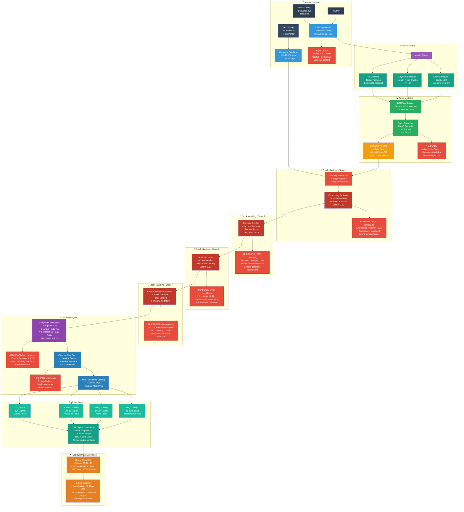

```mermaid
graph TB
    subgraph "🔍 Data Collection"
        A1[NewsAPI] --> B[News Aggregator<br/>- Parallel Scraping<br/>- ThreadPoolExecutor]
        A2[Web Scraping<br/>- BeautifulSoup<br/>- Requests] --> B
        A3[SEC Filings<br/>- EDGAR API<br/>- 10-K Parser] --> C[Company Database<br/>- 10,229 Tickers<br/>- CSV Storage]
        
        B --> DISCARD1[❌ DISCARD<br/>Articles < 300 chars<br/>Articles > 100k chars<br/>Duplicate content]
    end
    
    subgraph "🧠 NLP Processing"
        B --> D[Article Queue]
        D --> E1[Entity Extraction<br/>- spaCy NER<br/>- en_core_web_sm]
        D --> E2[Keyword Extraction<br/>- spaCy Noun Chunks<br/>- TF-IDF]
        D --> E3[Text Cleaning<br/>- Regex Patterns<br/>- Boilerplate Removal]
    end
    
    subgraph "📊 Topic Modeling"
        E1 --> F[BERTopic Engine<br/>- Sentence-Transformers<br/>- all-MiniLM-L6-v2]
        E2 --> F
        E3 --> F
        F --> G[Topic Clustering<br/>- UMAP Reduction<br/>- HDBSCAN<br/>- Min Size: 8]
        G --> H[Semantic Filtering<br/>- Word2Vec<br/>- GoogleNews-300<br/>- Generic Term Removal]
        
        G --> DISCARD2[❌ DISCARD<br/>Noise cluster Topic -1<br/>Clusters < 8 articles<br/>Generic keywords]
    end
    
    subgraph "🎯 Stock Matching - Stage 1"
        H --> I[Multi-Signal Matcher<br/>- 4-Stage Pipeline<br/>- Configurable Depth]
        C --> I
        
        I --> J1[Embedding Similarity<br/>- Cosine Distance<br/>- MiniLM-L6 Vectors<br/>Gate: > 0.05]
        
        J1 --> DISCARD3[❌ DISCARD ~9,000 companies<br/>Embedding similarity < 0.05<br/>Semantically unrelated<br/>Wrong industry/sector]
    end
    
    subgraph "🎯 Stock Matching - Stage 2"
        J1 --> J2[Keyword Overlap<br/>- Jaccard Similarity<br/>- Domain Terms<br/>Gate: > 0.03-0.05]
        
        J2 --> DISCARD4[❌ DISCARD ~70% remaining<br/>Keyword overlap too low<br/>No domain term matches<br/>Generic company descriptions]
    end
    
    subgraph "🎯 Stock Matching - Stage 3"
        J2 --> J3[NLI Verification<br/>- CrossEncoder<br/>- Hypothesis Testing<br/>Gate: > 0.20]
        
        J3 --> DISCARD5[❌ DISCARD weak candidates<br/>NLI score < 0.20<br/>No semantic entailment<br/>False keyword matches]
    end
    
    subgraph "🎯 Stock Matching - Stage 4"
        J3 --> J4[Entity & Mention Validation<br/>- Context Windows<br/>- Ticker Variants<br/>- Company Indicators]
        
        J4 --> DISCARD6[❌ DISCARD false positives<br/>Short ticker common words<br/>No company context<br/>ETFs/REITs without mentions]
    end
    
    subgraph "📈 Scoring Engine"
        J4 --> K[Composite Relevance<br/>- Weighted Sum<br/>- 0.65 NLI + 0.15 KW<br/>+ 0.10 Mention + 0.10 Entity<br/>Final Gate: > 0.15]
        
        K --> DISCARD7[❌ DISCARD low relevance<br/>Composite score < 0.15<br/>Weak multi-signal match<br/>Likely irrelevant]
        
        K --> L[yFinance Data Fetch<br/>- Historical Prices<br/>- Volume & Volatility<br/>- Fundamentals]
        
        L --> DISCARD8[❌ DISCARD unavailable<br/>Delisted tickers<br/>No yFinance data<br/>Invalid symbols]
        
        L --> M[Multi-Timeframe Scoring<br/>- 4 Trading Styles<br/>- Custom Algorithms]
    end
    
    subgraph "💎 Output Layer"
        M --> N1[Day Trading<br/>- 1d-1w Signals<br/>- Momentum Focus]
        M --> N2[Swing Trading<br/>- 1w-3m Signals<br/>- Trend Focus]
        M --> N3[Position Trading<br/>- 3m-1y Signals<br/>- Valuation Focus]
        M --> N4[Long-Term<br/>- 1y+ Signals<br/>- Quality Focus]
        
        N1 --> O[CSV Export + Supabase<br/>- Timestamped Files<br/>- Cloud Storage<br/>- daily-reports Bucket<br/>~50 companies per topic]
        N2 --> O
        N3 --> O
        N4 --> O
    end
    
    subgraph "☁️ Deployment & Automation"
        O --> P[Oracle Cloud VM<br/>- Ubuntu 20.04 LTS<br/>- VM.Standard.E2.1.Micro<br/>- 1GB RAM, 50GB Storage]
        P --> Q[Cron Scheduler<br/>- Runs Daily at 12:00 AM UTC<br/>- Auto-executes pipeline.py<br/>- Logs to /var/log/watchtower/]
    end
    
    style A1 fill:#2c3e50,color:#fff
    style A2 fill:#2c3e50,color:#fff
    style A3 fill:#34495e,color:#fff
    style B fill:#3498db,color:#fff
    style C fill:#3498db,color:#fff
    style D fill:#9b59b6,color:#fff
    style E1 fill:#16a085,color:#fff
    style E2 fill:#16a085,color:#fff
    style E3 fill:#16a085,color:#fff
    style F fill:#27ae60,color:#fff
    style G fill:#27ae60,color:#fff
    style H fill:#f39c12,color:#fff
    style I fill:#e74c3c,color:#fff
    style J1 fill:#c0392b,color:#fff
    style J2 fill:#c0392b,color:#fff
    style J3 fill:#c0392b,color:#fff
    style J4 fill:#c0392b,color:#fff
    style K fill:#8e44ad,color:#fff
    style L fill:#2980b9,color:#fff
    style M fill:#2980b9,color:#fff
    style N1 fill:#1abc9c,color:#fff
    style N2 fill:#1abc9c,color:#fff
    style N3 fill:#1abc9c,color:#fff
    style N4 fill:#1abc9c,color:#fff
    style O fill:#16a085,color:#fff
    style P fill:#e67e22,color:#fff
    style Q fill:#e67e22,color:#fff
    
    style DISCARD1 fill:#e74c3c,color:#fff,stroke:#c0392b,stroke-width:2px
    style DISCARD2 fill:#e74c3c,color:#fff,stroke:#c0392b,stroke-width:2px
    style DISCARD3 fill:#e74c3c,color:#fff,stroke:#c0392b,stroke-width:2px
    style DISCARD4 fill:#e74c3c,color:#fff,stroke:#c0392b,stroke-width:2px
    style DISCARD5 fill:#e74c3c,color:#fff,stroke:#c0392b,stroke-width:2px
    style DISCARD6 fill:#e74c3c,color:#fff,stroke:#c0392b,stroke-width:2px
    style DISCARD7 fill:#e74c3c,color:#fff,stroke:#c0392b,stroke-width:2px
    style DISCARD8 fill:#e74c3c,color:#fff,stroke:#c0392b,stroke-width:2px
```
